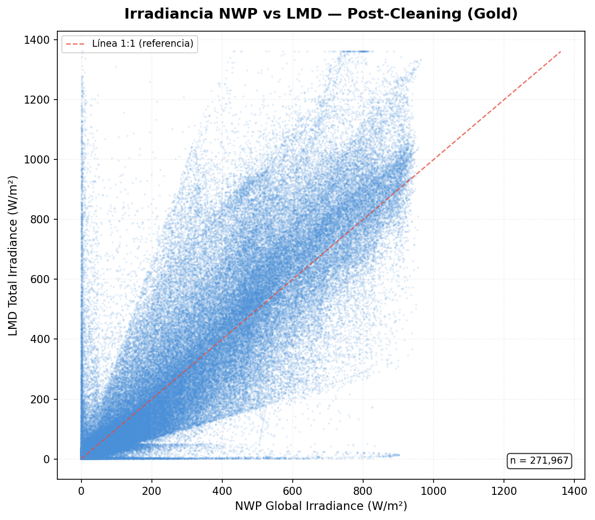

# ETL Solar Serverless - Procesamiento del Dataset PVOD ☀️


## 📖 Descripción del Proyecto

La intermitencia es el mayor desafío de la energía solar. Este proyecto resuelve ese problema construyendo un **pipeline de datos serverless de grado industrial**. Al ingestar, limpiar matemáticamente (Zeroing nocturno, filtros Hampel) y alinear datos meteorológicos (NWP) con sensores locales (LMD), este Data Warehouse entrega métricas inmaculadas listas para alimentar modelos de Inteligencia Artificial. El resultado permite a los operadores de redes **predecir la generación con alta precisión**, evitar multas por desbalances y optimizar la venta de energía.

El flujo culmina exponiendo métricas agregadas mediante una API RESTful de alto rendimiento.

## 🏗️ Arquitectura del Sistema (GCP)

La solución está diseñada bajo principios de Clean Architecture y opera de forma 100% serverless en Google Cloud Platform (GCP).

* **Orquestación:** Utilización de **Cloud Scheduler** para la invocación asíncrona y automatizada del pipeline ETL.
* **Staging Area (Capa Oro):** **Cloud Storage** actúa como buffer temporal, almacenando datos extraídos en formato binario altamente comprimido Apache Parquet.
* **Data Warehouse:** **BigQuery** gestiona la persistencia transaccional ACID de los datos procesados, utilizando esquemas estrictamente tipados y almacenamiento columnar.
* **Procesamiento y API:** Contenedores Docker inmutables desplegados en **Cloud Run** que alojan las rutinas del ETL (basadas en Polars) y el microservicio de la API (construido con FastAPI).

## 🚀 Highlights Técnicos

* **Patrones de Diseño:** Implementación estricta de **Patrón Factory** (ingesta) y **Strategy** (limpieza).
* **FinOps Integrado:** Protección de costos mediante **Dry Runs** y cuotas límite en BigQuery (`maximum_bytes_billed`).
* **Performance:** Sustitución de Pandas por **Polars** (Lazy Evaluation) para maximizar la eficiencia de CPU/RAM en contenedores efímeros.

## 🗺️ Roadmap y Estado del Proyecto

* [x] **Fase 0: Setup Inicial & Preprocesamiento Off-line**
    * Definición del Product Requirements Document (PRD).
    * Configuración del repositorio, `.gitignore` y variables de entorno base.
    * **Preprocesamiento Off-line:** Creación del script `scripts/consolidate_pvod.py` con Polars para consolidar los 10 CSVs del dataset PVOD en un único archivo maestro `data/pvod.csv`, validando sus 271,968 registros e incluyendo la columna `station_id` para el clustering en BigQuery.
* [x] **Fase 1: Aprovisionamiento de Infraestructura, Seguridad y Componentes de Ingesta**
    * [x] **Fase 1.0 (Entorno de Desarrollo):** Configuración de la Cuenta de Servicio en Google Cloud con roles estrictos (BigQuery Editor/User, Storage Creator, Logging Writer) y obtención de las credenciales base para `.env.example` (`GCP_PROJECT_ID`, `GOOGLE_APPLICATION_CREDENTIALS`).
    * [x] **Fase 1.1 (BigQuery):** Creación del Dataset en BigQuery (`serverless_solar_etl_dataset`) y definición de la tabla destino (`pvod_metrics`).
    * [x] **Fase 1.2 (Cloud Storage):** Creación y configuración del GCS Bucket (Capa Oro) multiregional (`GCS_BUCKET_NAME`).
    * [x] Implementación de capas de ingesta usando el Patrón Factory.
* [x] **Fase 2: Transformación Analítica, Fusión Numérica y Perfilado**
    * [x] Carga perezosa con Polars (`scan_csv`) y alineamiento temporal a grilla de 15 minutos.
    * [x] Aplicación del Patrón Strategy para la purga heurística (NighttimeZeroing, HampelFilter, MissingValueImputer).
    * [x] Volcado final en Apache Parquet comprimido (Zstandard) a GCS (Capa Oro).
* [x] **Fase 3: Integración Transaccional Resiliente y Despliegue de Observabilidad**
    * [x] Implementación de JSON Structured Logging integrado con Google Cloud Logging.
    * [x] Ejecución atómica e idempotente del BigQuery Load Job.
* [x] **Fase 4: Contenedorización Final, Despliegue API Serverless y Servicio de Consulta**
    * [x] Desarrollo de la API con FastAPI y Pydantic.
    * [x] Contenedorización multi-stage purgada y validada.
    * [x] Scripts de despliegue final en Google Cloud Run y Artifact Registry.

---

## 📊 Evidencia de Calidad y Procesamiento de Datos

Como evidencia de que la extracción de datos estáticos desde GitHub Raw, la posterior transformación según los filtros físicos y heurísticos definidos en [Task 2.2 - data_cleaning.md](file:///Users/matias95lopez/Desktop/serverless-solar-etl/docs/implemented-tasks/Task%202.2%20-%20data_cleaning.md) y la carga final en BigQuery funcionan de manera integrada, presentamos las siguientes visualizaciones obtenidas del dataset procesado:

### 1. Relación NWP vs LMD de la Irradiancia Total (Scatter Plot)
Este gráfico de dispersión compara la radiación meteorológica predicha (NWP) con la medición local (LMD). La aplicación de la estrategia `IrradianceOutlierStrategy` permite descartar discrepancias físicas severas (por encima o debajo de los ratios realistas de radiación). Como resultado de la limpieza y la interpolación en la Capa Oro, la dispersión se alinea cohesionadamente alrededor del ratio 1:1, reduciendo el ruido analítico y permitiendo un almacenamiento de calidad en Google Cloud.



### 2. Perfil de Potencia vs Hora del Día (Diurnal Power Profile)
A través de la estrategia `NighttimeZeroingStrategy`, calculamos la elevación solar en base a la latitud y longitud representativas del proyecto PVOD en Hebei, China. Al forzar a cero absoluto todas las variables de irradiancia y producción eléctrica cuando el sol está bajo el horizonte ($\alpha \le 0^\circ$), eliminamos por completo el ruido nocturno e instrumental de los sensores. La curva resultante muestra un perfil diurno limpio y de comportamiento físico correcto, listo para ser consumido en BigQuery o mediante nuestra API.


Con esto se consolida el objetivo del proyecto: limpiar datos provenientes del dataset PVOD e integrarlos con éxito en la suite serverless de Google Cloud Platform (GCS y BigQuery) con niveles óptimos de calidad de datos.

---

## ⚙️ Configuración Inicial con Google Cloud

Antes de desplegar, necesitas autenticarte y configurar los permisos de IAM en GCP. Los siguientes pasos solo se ejecutan **una vez** (o cuando cambies de cuenta/proyecto).

### 1. Autenticarse con `gcloud`

```bash
gcloud auth login
```

Se abrirá tu navegador para iniciar sesión con tu cuenta de Google. Al completar la autenticación verás algo como:

```
You are now logged in as [tu-email@gmail.com].
Your current project is [tu-proyecto-id].  You can change this setting by running:
  $ gcloud config set project PROJECT_ID
```
### 2. Configuramos proyecto por defecto 

Esto es muy importante porque le dice a gcloud sobre qué proyecto de Google Cloud vas a ejecutar los siguientes comandos, evitando que tengas que pasar el parámetro --project en cada uno de ellos.

### 3. Asignar permisos de Storage a la Cuenta de Servicio

La cuenta de servicio de Cloud Run necesita acceso de lectura/escritura al bucket de GCS para subir y leer archivos Parquet:

```bash
gcloud storage buckets add-iam-policy-binding \
  gs://<NOMBRE_DE_TU_BUCKET> \
  --member="serviceAccount:<TU_CUENTA_DE_SERVICIO>@<PROYECTO>.iam.gserviceaccount.com" \
  --role="roles/storage.objectAdmin"
```

**Salida esperada:** Una lista de `bindings` en formato YAML confirmando que el rol `roles/storage.objectAdmin` fue asignado correctamente a tu cuenta de servicio.

### 4. Configurar secretos en Secret Manager

El nombre del dataset de BigQuery se inyecta en Cloud Run como un secreto. Si necesitas actualizar su valor:

```bash
echo -n "serverless_solar_etl_dataset" | gcloud secrets versions add bq_dataset_id --data-file=-
```

**Salida esperada:**
```
Created version [N] of the secret [bq_dataset_id].
```

---

## 🚀 Despliegue en Producción (Cloud Run)

Para desplegar la aplicación en Google Cloud Run, asegúrate de tener `gcloud` autenticado y **Docker Desktop corriendo**. Luego ejecuta los scripts desde la carpeta `scripts/`:

### Paso 1: Construir y subir la imagen a Artifact Registry

```bash
cd scripts
./build_and_push.sh
```

**Salida esperada:**

```
✅ Variables cargadas desde .env
==========================================================
🚀 Iniciando Build & Push a Google Artifact Registry
==========================================================
Project ID : <tu-proyecto>
Region     : us-central1
Repository : solar-etl-repo
Image URI  : us-central1-docker.pkg.dev/<tu-proyecto>/solar-etl-repo/pvod-api:<commit-hash>
==========================================================

[1/3] Construyendo imagen Docker localmente...
[+] Building ... FINISHED
[2/3] Autenticando con Google Artifact Registry...
[3/3] Subiendo imagen a Artifact Registry...
...
✅ ¡Proceso completado con éxito!
La imagen está lista para ser desplegada en Cloud Run.
```

### Paso 2: Desplegar la API Serverless en Cloud Run

```bash
./deploy_to_cloud_run.sh
```

**Salida esperada:**

```
✅ Variables cargadas desde .env
==========================================================
☁️ Iniciando despliegue a Google Cloud Run
==========================================================
Project ID : <tu-proyecto>
Region     : us-central1
Service    : pvod-solar-api
Image URI  : us-central1-docker.pkg.dev/<tu-proyecto>/solar-etl-repo/pvod-api:<commit-hash>
==========================================================
Deploying container to Cloud Run service [pvod-solar-api]...
✓ Deploying... Done.
  ✓ Creating Revision...
  ✓ Routing traffic...
  ✓ Setting IAM Policy...
Done.
Service [pvod-solar-api] revision [pvod-solar-api-xxxxx-xxx] has been deployed
  and is serving 100 percent of traffic.
Service URL: https://pvod-solar-api-XXXXXXXXXX.us-central1.run.app

✅ ¡Despliegue ejecutado!
Tu API Serverless está operativa.
```

> **Importante:** Copia la **Service URL** que aparece al final — la necesitarás para realizar consultas en producción.

*Nota: El servicio está configurado para **escalar a cero** (`--min-instances 0`), por lo que no genera costos cuando no hay tráfico.*

---

## 💻 Servidor Local (Desarrollo)

Para probar cambios sin reconstruir la imagen Docker, puedes levantar la API directamente en tu máquina.

### Iniciar el servidor local

```bash
# 1. Activar el entorno virtual (desde la raíz del proyecto)
source .venv/bin/activate

# 2. Ejecutar Uvicorn
uvicorn app.main:app --host 0.0.0.0 --port 8080 --reload --app-dir src
```

| Flag             | Descripción                                                          |
| ---------------- | -------------------------------------------------------------------- |
| `app.main:app`   | Ruta al objeto FastAPI: módulo `app.main`, variable `app`.           |
| `--host 0.0.0.0` | Acepta conexiones desde cualquier interfaz (no solo `127.0.0.1`).    |
| `--port 8080`    | Puerto en el que escuchará el servidor (igual que en Cloud Run).     |
| `--reload`       | Recarga automáticamente al detectar cambios en el código.            |
| `--app-dir src`  | Indica que el paquete `app` está dentro de la carpeta `src/`.        |

**Salida esperada:**
```
INFO:     Uvicorn running on http://0.0.0.0:8080 (Press CTRL+C to quit)
INFO:     Started reloader process [xxxxx] using WatchFiles
INFO:     Started server process [xxxxx]
INFO:     Application startup complete.
```

### Detener o reiniciar el servidor

* **Detener:** Presiona `Ctrl+C` en la terminal donde corre Uvicorn.
* **Si el puerto queda ocupado** (`[Errno 48] Address already in use`):
  ```bash
  kill $(lsof -ti:8080)
  ```

---

## 🔍 Consultando la API

La API expone dos endpoints principales. Ambos funcionan tanto en local como en producción.

| Endpoint                      | Método | Descripción                                          |
| ----------------------------- | ------ | ---------------------------------------------------- |
| `/api/v1/etl/run`             | POST   | Ejecuta el pipeline ETL completo (extracción → BQ).  |
| `/api/v1/metrics/aggregate`   | POST   | Consulta de promedio de potencia por estación.        |

### Versión Local

Una vez que el servidor esté corriendo con Uvicorn (ver sección anterior), las URLs son:

```
POST http://localhost:8080/api/v1/etl/run
POST http://localhost:8080/api/v1/metrics/aggregate
```

### Versión en Producción (Cloud Run)

Para hacer consultas en producción usando la URL de Cloud Run (ej: `https://pvod-solar-api-XXXXXXXXXX.us-central1.run.app/`), tienes **tres métodos**:

---

#### Método 1: Swagger UI (Interfaz Interactiva) — El más fácil

FastAPI genera automáticamente documentación interactiva. Solo abre en tu navegador:

```
https://<TU_URL_CLOUD_RUN>/docs
```

1. Busca la ruta deseada (ej: `/api/v1/metrics/aggregate`).
2. Haz clic en **"Try it out"**.
3. Edita el JSON del body y haz clic en **"Execute"**.
4. La respuesta aparece directamente en la página.

---

#### Método 2: cURL (Terminal)

**Ejecutar el pipeline ETL:**

```bash
curl -X POST "https://<TU_URL_CLOUD_RUN>/api/v1/etl/run"
```

**Consultar métricas agregadas (con body JSON):**

```bash
curl -X POST "https://<TU_URL_CLOUD_RUN>/api/v1/metrics/aggregate" \
     -H "Content-Type: application/json" \
     -d '{
           "start_date": "2018-07-01T00:00:00",
           "end_date": "2018-07-02T23:59:59",
           "dry_run": true
         }'
```

---

#### Método 3: Postman / Thunder Client / Insomnia

1. Configura el método como **POST**.
2. Usa la URL de Cloud Run como base (ej: `https://<TU_URL_CLOUD_RUN>/api/v1/metrics/aggregate`).
3. En la pestaña **Body**, selecciona **raw** y tipo **JSON**.
4. Ingresa el body:
   ```json
   {
     "start_date": "2018-07-01T00:00:00",
     "end_date": "2018-07-02T23:59:59",
     "dry_run": true
   }
   ```

---

### Ejemplo de Respuesta: ETL Run

```json
{
    "status": "success",
    "records_processed": 271967,
    "gcs_uri": "gs://<bucket>/gold/pvod_XXXXXXXX_XXXXXX.parquet",
    "bigquery_job_id": "pvod_load_...",
    "duration_seconds": 23.9,
    "started_at": "2026-05-26T19:07:43.404322+00:00",
    "completed_at": "2026-05-26T19:08:07.304509+00:00",
    "steps_completed": [
        "extraction",
        "transformation",
        "cleaning",
        "gold_export",
        "bigquery_load"
    ]
}
```

### Ejemplo de Respuesta: Dry Run de Métricas

Si `dry_run` es `true`, la respuesta estima los bytes que la consulta procesaría **sin incurrir en costos reales**:

```json
{
    "estimated_bytes_processed": 4352000,
    "message": "Estimación completada exitosamente sin cargos a facturación."
}
```

### Ejemplo de Respuesta: Consulta Real de Métricas

Si `dry_run` es `false` (o se omite), la respuesta contiene los promedios de potencia por estación:

```json
{
    "results": [
        { "station_id": 0, "avg_power": 125.43 },
        { "station_id": 1, "avg_power": 130.87 },
        { "station_id": 2, "avg_power": 118.22 }
    ],
    "total_rows": 10,
    "bytes_processed": 4352000
}
```

---

## Resumen Rápido

| Escenario                   | Comando / Acción                                                                |
| --------------------------- | ------------------------------------------------------------------------------- |
| **Autenticarse en GCP**     | `gcloud auth login`                                                             |
| **Construir imagen Docker** | `cd scripts && ./build_and_push.sh`                                             |
| **Desplegar a Cloud Run**   | `./deploy_to_cloud_run.sh`                                                      |
| **Servidor local**          | `source .venv/bin/activate && uvicorn app.main:app --host 0.0.0.0 --port 8080 --reload --app-dir src` |
| **Consultar en producción** | Usar Swagger UI (`/docs`), cURL, o Postman con la URL de Cloud Run              |
| **Consultar en local**      | Mismos endpoints pero con `http://localhost:8080`                                |
