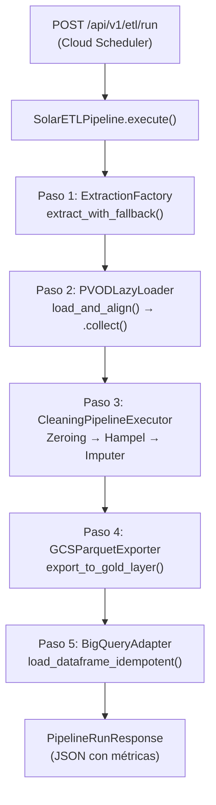

# Walkthrough: Pipeline ETL Orchestrator

## Resumen

Se implementó el orquestador faltante que conecta las 5 fases del ETL en un flujo ejecutable de principio a fin, más un endpoint HTTP para que Cloud Scheduler pueda dispararlo.

## Flujo Implementado



## Archivos Creados

### [pipeline.py](file:///Users/matias95lopez/Desktop/serverless-solar-etl/src/app/application/pipeline.py)
- **Capa**: Application (caso de uso)
- **Clase**: `SolarETLPipeline` — orquestador con Dependency Injection
- **Dataclass**: `PipelineResult` — resultado inmutable con métricas
- **Factory**: `build_pipeline()` — Composition Root que wirea todas las dependencias concretas

### [etl_router.py](file:///Users/matias95lopez/Desktop/serverless-solar-etl/src/app/interfaces/etl_router.py)
- **Capa**: Interfaces
- **Endpoint**: `POST /api/v1/etl/run` — trigger HTTP para el pipeline
- Manejo granular de errores con `SolarETLError` → HTTP 500

## Archivos Modificados

### [schemas.py](file:///Users/matias95lopez/Desktop/serverless-solar-etl/src/app/interfaces/schemas.py)
```diff:schemas.py
"""
interfaces/schemas.py — Modelos Pydantic para la API
======================================================
Define los contratos de entrada y salida para los endpoints
del microservicio, asegurando tipado estricto y validación.
"""

from __future__ import annotations

from datetime import datetime
from pydantic import BaseModel, Field


class MetricsQueryRequest(BaseModel):
    """Solicitud para consultar métricas agregadas."""

    start_date: datetime = Field(
        ...,
        description="Fecha y hora de inicio para el filtrado temporal (LST).",
    )
    end_date: datetime = Field(
        ...,
        description="Fecha y hora de fin para el filtrado temporal (LST).",
    )
    dry_run: bool = Field(
        default=False,
        description="Si es True, devuelve el costo estimado en bytes sin ejecutar la consulta real.",
    )


class StationPowerAvg(BaseModel):
    """Métrica agregada promedio por estación."""

    station_id: int = Field(..., description="ID de la estación fotovoltaica (0-9).")
    avg_power: float | None = Field(..., description="Promedio de potencia generada (kW).")


class MetricsQueryResponse(BaseModel):
    """Respuesta con los resultados reales de la consulta."""

    results: list[StationPowerAvg]
    total_rows: int
    bytes_processed: int | None = None


class DryRunResponse(BaseModel):
    """Respuesta del costo estimado (Dry Run)."""

    estimated_bytes_processed: int
    message: str = "Estimación completada exitosamente sin cargos a facturación."
===
"""
interfaces/schemas.py — Modelos Pydantic para la API
======================================================
Define los contratos de entrada y salida para los endpoints
del microservicio, asegurando tipado estricto y validación.
"""

from __future__ import annotations

from datetime import datetime
from pydantic import BaseModel, Field


class MetricsQueryRequest(BaseModel):
    """Solicitud para consultar métricas agregadas."""

    start_date: datetime = Field(
        ...,
        description="Fecha y hora de inicio para el filtrado temporal (LST).",
    )
    end_date: datetime = Field(
        ...,
        description="Fecha y hora de fin para el filtrado temporal (LST).",
    )
    dry_run: bool = Field(
        default=False,
        description="Si es True, devuelve el costo estimado en bytes sin ejecutar la consulta real.",
    )


class StationPowerAvg(BaseModel):
    """Métrica agregada promedio por estación."""

    station_id: int = Field(..., description="ID de la estación fotovoltaica (0-9).")
    avg_power: float | None = Field(..., description="Promedio de potencia generada (kW).")


class MetricsQueryResponse(BaseModel):
    """Respuesta con los resultados reales de la consulta."""

    results: list[StationPowerAvg]
    total_rows: int
    bytes_processed: int | None = None


class DryRunResponse(BaseModel):
    """Respuesta del costo estimado (Dry Run)."""

    estimated_bytes_processed: int
    message: str = "Estimación completada exitosamente sin cargos a facturación."


class PipelineRunResponse(BaseModel):
    """Respuesta de una ejecución del pipeline ETL completo.

    Contiene métricas detalladas de cada paso ejecutado, URIs de
    artefactos generados y el identificador del Load Job de BigQuery.
    """

    status: str = Field(
        ..., description="Estado de la ejecución: 'success' o 'failed'."
    )
    records_processed: int = Field(
        ..., description="Cantidad de registros procesados y cargados."
    )
    gcs_uri: str = Field(
        ..., description="URI del Parquet exportado a la Capa Oro (gs://...)."
    )
    bigquery_job_id: str = Field(
        ..., description="Identificador determinista (MD5) del Load Job de BigQuery."
    )
    duration_seconds: float = Field(
        ..., description="Duración total de la ejecución en segundos."
    )
    started_at: str = Field(
        ..., description="Timestamp ISO 8601 UTC del inicio."
    )
    completed_at: str = Field(
        ..., description="Timestamp ISO 8601 UTC del fin."
    )
    steps_completed: list[str] = Field(
        default_factory=list,
        description="Lista de pasos completados: extraction, transformation, cleaning, gold_export, bigquery_load.",
    )
```

### [main.py](file:///Users/matias95lopez/Desktop/serverless-solar-etl/src/app/main.py)
```diff:main.py
"""
main.py — Entry Point del Microservicio PVOD Solar ETL
=======================================================
Inicializa el sistema de logging estructurado JSON (Google Cloud Logging)
y el servidor FastAPI.  La configuración de logging se ejecuta ANTES de
cualquier importación que use ``logging.getLogger(__name__)`` para
garantizar que todos los módulos hereden el handler estructurado.
"""

from __future__ import annotations

import logging

from fastapi import FastAPI
from google.cloud import bigquery

from app.application.config import Settings
from app.infrastructure.cloud_logging import setup_cloud_logging
from app.interfaces.api import router as api_router

# ── Inicialización de Configuración y Logging ────────────────────────
settings = Settings()

setup_cloud_logging(
    log_level=settings.log_level,
    gcp_project_id=settings.gcp_project_id,
    environment=settings.environment,
)

logger = logging.getLogger(__name__)

# ── FastAPI Application ──────────────────────────────────────────────
app = FastAPI(
    title="PVOD Serverless Solar ETL API",
    description="API for accessing aggregated metrics from the Photovoltaic Power Output Dataset",
    version="1.0.0",
)


@app.on_event("startup")
async def on_startup() -> None:
    """Log de arranque del servicio con métricas estructuradas."""
    logger.info(
        "PVOD Solar ETL API iniciada",
        extra={
            "attributes": {
                "environment": settings.environment,
                "log_level": settings.log_level,
                "gcp_project_id": settings.gcp_project_id,
            },
        },
    )
    
    # Inicializar cliente BigQuery para reciclar conexiones
    try:
        if settings.google_application_credentials:
            app.state.bq_client = bigquery.Client.from_service_account_json(
                settings.google_application_credentials
            )
        else:
            app.state.bq_client = bigquery.Client(project=settings.gcp_project_id)
        logger.info("Cliente BigQuery inicializado exitosamente en app.state")
    except Exception as exc:
        logger.error(f"Fallo al inicializar cliente BigQuery: {exc}")

app.include_router(api_router)


@app.get("/")
async def root():
    logger.info("Root endpoint called.")
    return {"message": "PVOD Solar ETL API is running"}


@app.get("/health")
async def health_check():
    return {"status": "healthy"}

===
"""
main.py — Entry Point del Microservicio PVOD Solar ETL
=======================================================
Inicializa el sistema de logging estructurado JSON (Google Cloud Logging)
y el servidor FastAPI.  La configuración de logging se ejecuta ANTES de
cualquier importación que use ``logging.getLogger(__name__)`` para
garantizar que todos los módulos hereden el handler estructurado.
"""

from __future__ import annotations

import logging

from fastapi import FastAPI
from google.cloud import bigquery

from app.application.config import Settings
from app.infrastructure.cloud_logging import setup_cloud_logging
from app.interfaces.api import router as api_router
from app.interfaces.etl_router import router as etl_router

# ── Inicialización de Configuración y Logging ────────────────────────
settings = Settings()

setup_cloud_logging(
    log_level=settings.log_level,
    gcp_project_id=settings.gcp_project_id,
    environment=settings.environment,
)

logger = logging.getLogger(__name__)

# ── FastAPI Application ──────────────────────────────────────────────
app = FastAPI(
    title="PVOD Serverless Solar ETL API",
    description="API for accessing aggregated metrics from the Photovoltaic Power Output Dataset",
    version="1.0.0",
)


@app.on_event("startup")
async def on_startup() -> None:
    """Log de arranque del servicio con métricas estructuradas."""
    logger.info(
        "PVOD Solar ETL API iniciada",
        extra={
            "attributes": {
                "environment": settings.environment,
                "log_level": settings.log_level,
                "gcp_project_id": settings.gcp_project_id,
            },
        },
    )
    
    # Inicializar cliente BigQuery para reciclar conexiones
    try:
        if settings.google_application_credentials:
            app.state.bq_client = bigquery.Client.from_service_account_json(
                settings.google_application_credentials
            )
        else:
            app.state.bq_client = bigquery.Client(project=settings.gcp_project_id)
        logger.info("Cliente BigQuery inicializado exitosamente en app.state")
    except Exception as exc:
        logger.error(f"Fallo al inicializar cliente BigQuery: {exc}")

app.include_router(api_router)
app.include_router(etl_router)


@app.get("/")
async def root():
    logger.info("Root endpoint called.")
    return {"message": "PVOD Solar ETL API is running"}


@app.get("/health")
async def health_check():
    return {"status": "healthy"}

```

## Verificación

- ✅ Import check: `SolarETLPipeline`, `PipelineResult`, `build_pipeline`, `PipelineRunResponse`, `etl_router` importan correctamente
- ✅ Test suite completa: **102/102 tests passed** sin regresiones
- ✅ Endpoint registrado: `POST /api/v1/etl/run`
