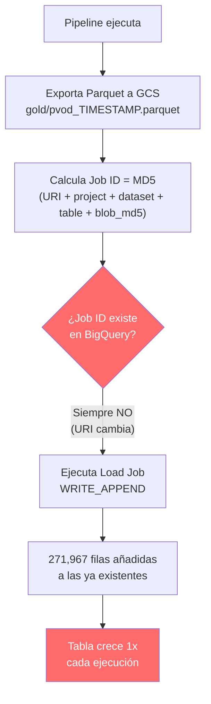

# 🔍 Diagnóstico: Filas Duplicadas en `pvod_metrics`

## Resumen del Problema

| Métrica | Valor |
|---|---|
| **Filas actuales en BQ** | 1,087,868 |
| **Filas únicas `(date_time, station_id)`** | 271,967 |
| **Factor de duplicación** | **4x exacto** |
| **Filas esperadas (PRD §4)** | 271,968 |
| **Particiones** | 349 |

> [!CAUTION]
> Cada fila del dataset PVOD existe exactamente **4 veces** en BigQuery. No hay filas parcialmente duplicadas — es una cuadruplicación perfecta del dataset completo.

---

## Causa Raíz

La causa es una combinación de **dos factores** en el adaptador de BigQuery:

### Factor 1: `WRITE_APPEND` como modo de escritura

En [bigquery_adapter.py:L229](file:///Users/matias95lopez/Desktop/serverless-solar-etl/src/app/infrastructure/bigquery_adapter.py#L229):

```python
job_config.write_disposition = bq_module.WriteDisposition.WRITE_APPEND
```

Cada Load Job **añade** todas las filas al final de la tabla existente, sin verificar si ya existen.

### Factor 2: Job IDs "deterministas" que en realidad cambian entre ejecuciones

El mecanismo de idempotencia en [bigquery_adapter.py:L202-L214](file:///Users/matias95lopez/Desktop/serverless-solar-etl/src/app/infrastructure/bigquery_adapter.py#L202-L214) calcula el `job_id` así:

```python
raw_seed = f"{gcs_uri}{self._project_id}{self._dataset_id}{self._table_id}{blob_md5}"
```

El problema es que el **GCS URI cambia en cada ejecución** del pipeline, porque [gcs_parquet_exporter.py:L231-L232](file:///Users/matias95lopez/Desktop/serverless-solar-etl/src/app/infrastructure/gcs_parquet_exporter.py#L231-L232) genera un blob con timestamp:

```python
ts = datetime.now(timezone.utc).strftime("%Y%m%d_%H%M%S")
return f"{GCS_GOLD_PREFIX}{PARQUET_BLOB_PREFIX}{ts}.parquet"
```

Resultado: `gold/pvod_20260520_200259.parquet`, `gold/pvod_20260526_185259.parquet`, etc.

→ Cada ejecución produce un Parquet con nombre distinto → URI distinta → MD5 distinto → **Job ID distinto** → BigQuery lo trata como un job nuevo y lo ejecuta → `WRITE_APPEND` acumula.

> [!IMPORTANT]
> **La idempotencia nunca funcionó.** El diseño asume que si el contenido del Parquet es igual, el Job ID sería igual. Pero como la URI cambia (por el timestamp en el nombre del blob), el hash del seed siempre es diferente, y BigQuery ejecuta el job como si fuera nuevo.

---

## Evidencia: Historial de Load Jobs

5 Load Jobs ejecutados, **4 de ellos posteriores a la creación de la tabla actual**:

| # | Job ID | Fecha (UTC) | Estado |
|---|--------|-------------|--------|
| 1 | `pvod_load_a0a4f6...` | 2026-05-20 20:02:59 | ✅ DONE *(pre-tabla actual)* |
| 2 | `pvod_load_f3ee97...` | 2026-05-20 20:16:47 | ✅ DONE *(creó la tabla)* |
| 3 | `pvod_load_aaffea...` | 2026-05-26 18:52:59 | ✅ DONE |
| 4 | `pvod_load_6fa694...` | 2026-05-26 19:07:54 | ✅ DONE |
| 5 | `pvod_load_661ed5...` | 2026-05-27 15:57:11 | ✅ DONE |

- La tabla se creó a las **20:17:01 del 20-May** (el job #1 cargó en una tabla previa que fue eliminada).
- Los **4 jobs restantes** (#2, #3, #4, #5) cargaron los mismos ~271,967 registros cada uno.
- **Todos los Job IDs son diferentes** (hashes distintos), por lo que BigQuery no detectó duplicación.
- Nota: Todos procesaron exactamente **43,514,720 bytes** — el mismo Parquet con diferente nombre.

---

## Verificación de Duplicación Exacta

```sql
-- Cada combinación (date_time, station_id) aparece exactamente 4 veces
SELECT duplicate_count, COUNT(*) as groups
FROM (
  SELECT date_time, station_id, COUNT(*) as duplicate_count
  FROM pvod_metrics GROUP BY 1, 2
)
GROUP BY 1;
```

| duplicate_count | groups |
|---|---|
| 4 | 271,967 |

→ **No hay filas con 1, 2, 3, o 5+ copias.** Es 4x uniforme en todo el dataset.

---

## Sobre el Screenshot (815,901 filas)

El screenshot mostraba **815,901 filas** (3x), lo que indica que fue tomado **antes** del último Load Job (#5, ejecutado hoy 27-May a las 15:57 UTC). Esto es consistente:

| Momento | Jobs acumulados | Filas | Multiplicador |
|---|---|---|---|
| Después del job #2 | 1 | 271,967 | 1x ✅ |
| Después del job #3 | 2 | 543,934 | 2x |
| Después del job #4 | 3 | 815,901 | 3x ← *screenshot* |
| Después del job #5 | 4 | 1,087,868 | 4x ← *ahora* |

---

## Diagrama del Flujo Defectuoso



---

## Opciones de Remediación (sin ejecutar aún)

> [!NOTE]
> Estas son opciones para cuando decidas reparar. No se ha modificado nada.

### Opción A: Cambiar a `WRITE_TRUNCATE`
- Cada Load Job reemplaza toda la tabla.
- **Pro**: Simple, imposible duplicar.
- **Contra**: Si el pipeline falla a medio camino, podrías perder datos temporalmente.

### Opción B: Fijar la URI del blob (nombre determinista, no basado en timestamp)
- Usar un nombre fijo como `gold/pvod_latest.parquet` y sobrescribir.
- **Pro**: El Job ID sería realmente idempotente (misma URI + mismo MD5 = mismo job_id).
- **Contra**: Pierdes el historial de Parquets en GCS.

### Opción C: Combinar ambas — `WRITE_TRUNCATE` + nombre determinista
- Máxima protección contra duplicados.

### Para limpiar los datos existentes:
```sql
-- Opción rápida: recrear con datos únicos
CREATE OR REPLACE TABLE `serverless-solar-etl.serverless_solar_etl_dataset.pvod_metrics`
PARTITION BY DATE(date_time)
CLUSTER BY station_id
AS
SELECT DISTINCT * FROM `serverless-solar-etl.serverless_solar_etl_dataset.pvod_metrics`;
```
